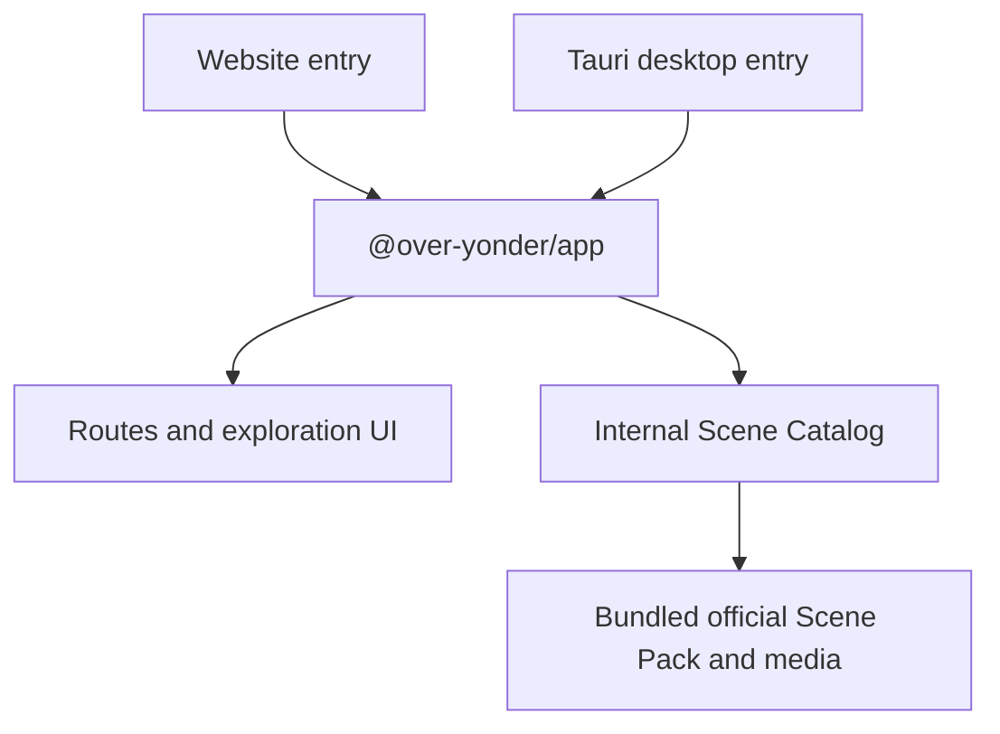

# Architecture Overview

## Overview

Over Yonder is a pnpm monorepo with one shared React application and two thin platform entry points:

- A browser application built with Vite.
- A desktop application hosted in a Tauri shell.

Vite+ is the repository's sole Web and TypeScript toolchain. Both entry points call the same parameterless `createApp()` API and run the same Phase One experience. The shared application owns routing, UI, content lookup, and the built-in Scene Pack.



## Workspace Structure

```text
over-yonder/
├── apps/
│   ├── website/          Browser entry point and Vite configuration
│   └── desktop/          Tauri frontend entry point and Rust application shell
├── packages/
│   └── app/              Shared React application, routes, features, styles, and content
└── docs/                 Product and architecture documentation
```

## Technology Stack

| Technology      | Responsibility                                                                    |
| --------------- | --------------------------------------------------------------------------------- |
| React           | Shared user interface                                                             |
| TanStack Router | Application routing inside the shared UI                                          |
| Tailwind CSS    | Shared utility-first styling                                                      |
| Base UI         | Headless, accessible UI primitives, including the spot scene drawer               |
| Tauri           | Desktop window and application shell                                              |
| Vite+           | Development server, builds, formatting, linting, type checks, and workspace tasks |

## Development Guidelines

### Styling

- Prefer Tailwind CSS utility classes for component styling.
- Avoid arbitrary values for conventional styling, such as `text-[0.6875rem]`. Use them for dynamic or special styling only when neither a built-in utility nor a theme token can express the requirement.

### Unit Testing

- Unit tests should primarily cover deterministic application logic. Test public behavior and edge cases rather than private implementation details.
- Keep UI tests selective. Use Testing Library for critical interactions, state transitions, and regressions that affect users; avoid broad snapshots, styling assertions, and tests that merely mirror component structure.

## Development Workflow

Run commands from the repository root:

```sh
vp run website#dev
vp run desktop#dev
vp check
vp run -r test
vp run -r build
```
