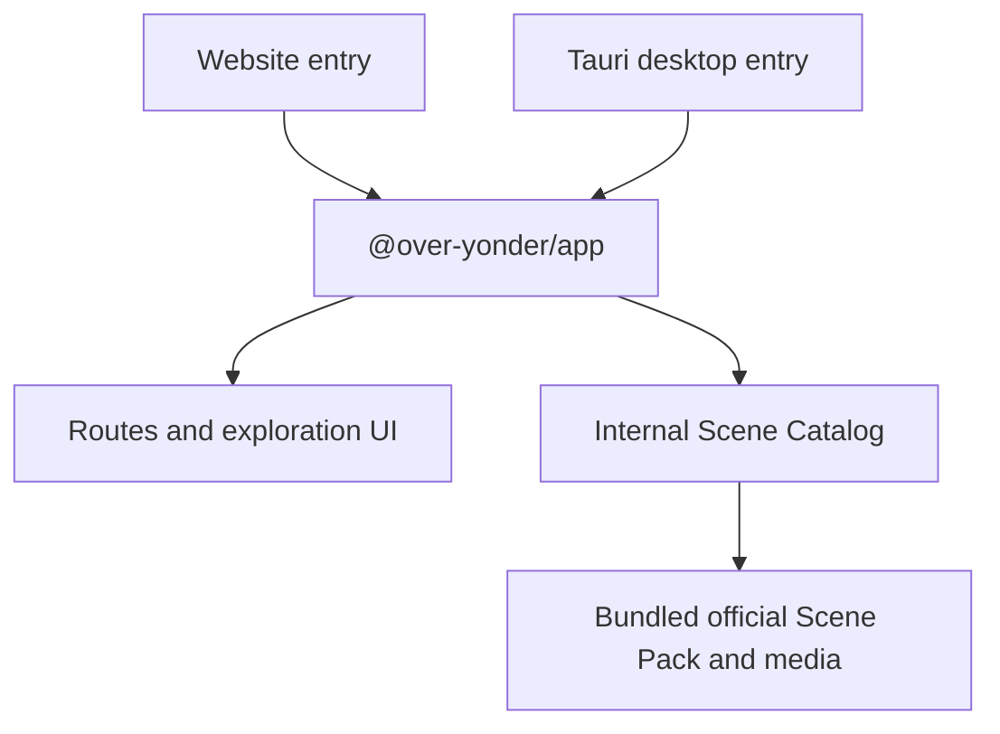
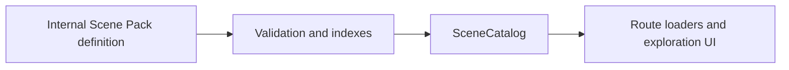

# Architecture Overview

## Overview

Over Yonder is a pnpm monorepo with one shared React application and two thin platform entry points:

- A browser application built with Vite.
- A desktop application hosted in a Tauri shell.

Vite+ is the repository's sole Web and TypeScript toolchain. Both entry points call the same parameterless `createApp()` API and run the same Phase One experience. The shared application owns routing, UI, content lookup, and the built-in Scene Pack.



Phase One does not have a capabilities package or platform adapter layer. The shared application does not currently require platform-specific services, and the desktop shell does not add native persistence or file-system behavior.

## Workspace Structure

```text
over-yonder/
├── apps/
│   ├── website/          Browser entry point and Vite configuration
│   └── desktop/          Tauri frontend entry point and Rust application shell
├── packages/
│   └── app/              Shared React application, routes, features, styles, and content
├── docs/                 Product and architecture documentation
├── package.json          Root development commands
├── pnpm-workspace.yaml   Workspace packages and dependency catalog
├── tsconfig.json         Shared TypeScript defaults
└── vite.config.ts        Repository-wide Vite+ checks and task configuration
```

### `apps/website`

The website entry mounts `createApp()` in a browser environment. It supplies no application services or content; its Vite configuration provides the browser build, React, and Tailwind CSS integration.

### `apps/desktop`

The desktop frontend mounts the same `createApp()` output inside Tauri. `src-tauri` contains the minimal Rust shell, application configuration, and default core permissions. Phase One does not use Tauri file-system plugins, AppData initialization, or desktop-only application behavior.

### `packages/app`

`@over-yonder/app` owns the complete shared Phase One experience:

- TanStack Router configuration and route-level error handling.
- The map list, map exploration, coordinate drawer, and scene views.
- The internal Scene Catalog interface, validation, indexing, and read models.
- The built-in official Scene Pack and its local image and video assets.
- Shared Tailwind CSS styles and Base UI primitives.

The package exposes `createApp()` without configuration arguments. Scene Pack definitions and catalog construction details remain internal and are not part of the package's public API.

## Content Architecture

Official Phase One content is compiled into `@over-yonder/app`. Media files are imported as static URLs, so website and desktop builds can present all official maps and scenes without a network connection.

The content layer separates authored definitions from UI-facing data:



`SceneCatalog` is the application-facing boundary for listing maps and resolving map/scene relationships. It hides raw pack configuration, preserves authored display order, rejects invalid official content during application construction, and prevents routes and components from depending on the storage shape.

Phase One intentionally defines no external Scene Pack file format, import adapter, compatibility contract, download flow, or persistence layer.

## Technology Roles

| Technology      | Responsibility                                                                    |
| --------------- | --------------------------------------------------------------------------------- |
| React           | Shared user interface                                                             |
| TanStack Router | Application routing inside the shared UI                                          |
| Tailwind CSS    | Shared utility-first styling                                                      |
| Base UI         | Headless, accessible UI primitives, including the coordinate drawer               |
| Tauri           | Desktop window and application shell                                              |
| Vite+           | Development server, builds, formatting, linting, type checks, and workspace tasks |
| pnpm catalog    | Central dependency versions shared by workspace packages                          |

## Development Workflow

Run commands from the repository root:

```sh
vp run website#dev
vp run desktop#dev
vp check
vp run -r test
vp run -r build
```

The root `ready` script runs checks, workspace tests, and workspace builds. Vite+ also manages the staged-file checks used by the Git hooks.

## Dependency Direction and Future Platform Seams

The website and desktop entry points depend on `@over-yonder/app`; the shared application does not depend on either entry point or on Tauri APIs. Built-in content belongs to the shared application because both platforms consume the same read-only catalog.

A platform abstraction should be introduced only when a concrete feature has meaningfully different browser and desktop implementations. At that point, define the narrow contract required by that feature and compose its implementations at the platform boundary. Do not restore a general capabilities layer in anticipation of hypothetical divergence.
