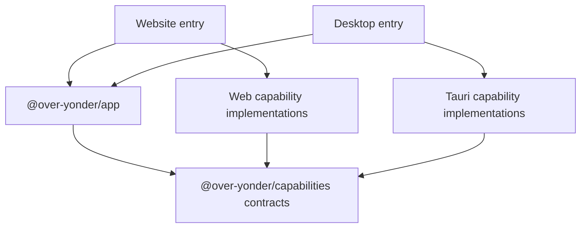

# Architecture Overview

## Overview

Over Yonder is a pnpm monorepo with one shared React application and two
platform entry points:

- A browser application built with Vite.
- A desktop application hosted in a Tauri shell.

Vite+ is the repository's sole Web and TypeScript toolchain.

Each platform entry point assembles the shared UI with its platform-specific
capabilities. This keeps environment checks and native API usage outside the
shared React application.



## Workspace Structure

```text
over-yonder/
├── apps/
│   ├── website/          Browser entry point and Vite configuration
│   └── desktop/          Tauri frontend entry point and Rust application shell
├── packages/
│   ├── app/              Shared React application, routes, features, and styles
│   └── capabilities/     Platform-neutral contracts and platform adapters
├── docs/                 Product and architecture documentation
├── package.json          Root development commands
├── pnpm-workspace.yaml   Workspace packages and dependency catalog
├── tsconfig.json         Shared TypeScript defaults
└── vite.config.ts        Repository-wide Vite+ checks and task configuration
```

### `apps/website`

The website entry creates the shared React application and supplies the
capability implementations required for a browser environment. Its Vite
configuration enables React and Tailwind CSS.

### `apps/desktop`

The desktop frontend creates the same React application but supplies
Tauri-specific capability implementations. `src-tauri` contains the Rust shell,
native plugin setup, application configuration, and desktop permissions.

### `packages/app`

`@over-yonder/app` owns the shared UI. It contains the TanStack Router setup,
application features, and the shared Tailwind CSS entry point. Base UI is
available here as the headless component foundation for future interfaces.

The package exposes `createApp(capabilities)`, so platform entry points provide
environment-specific behavior without adding platform checks to UI code.

### `packages/capabilities`

`@over-yonder/capabilities` defines the boundary between shared application code
and platform APIs. It exposes platform-neutral contracts together with separate
Web and Tauri implementations.

The platform entry points select the appropriate implementations and pass them
to `createApp`. As a result, shared features consume stable contracts instead of
checking whether they are running in a browser or Tauri window.

## Technology Roles

| Technology      | Responsibility                                                                    |
| --------------- | --------------------------------------------------------------------------------- |
| React           | Shared user interface                                                             |
| TanStack Router | Application routing inside the shared UI                                          |
| Tailwind CSS    | Shared utility-first styling                                                      |
| Base UI         | Headless, accessible UI component primitives                                      |
| Tauri           | Desktop window and native platform integration                                    |
| Vite+           | Development server, builds, formatting, linting, type checks, and workspace tasks |
| pnpm catalog    | Central dependency versions shared by workspace packages                          |

## Development Workflow

Run commands from the repository root:

```sh
vp run website#dev
vp run desktop#dev
vp check
vp run -r test
vp run -r build
```

The root `ready` script runs checks, workspace tests, and workspace builds. Vite+
also manages the staged-file checks used by the Git hooks.

## Dependency Direction

Platform entry points may depend on shared packages and select platform
adapters. Shared application code may depend on capability contracts, but it
should not directly import browser-specific, Tauri-specific, or other native
APIs. New platform behavior should follow the same pattern: define a small
shared contract, add platform implementations, and inject them at each platform
entry point.
