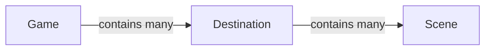
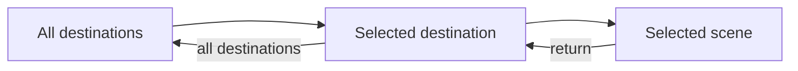

# Game Design Overview

> **Status:** Phase One baseline. This document defines the implemented destination-to-scene exploration flow and its deliberate product boundaries.

## Vision

Over Yonder is envisioned as a desktop companion and idle game. It provides an atmospheric scene that can stay open alongside the player's daily activities. The Phase One experience focuses on choosing a destination, exploring its scenes, and settling into a visual scene.

The design uses the following references:

| Area                 | Direction              |
| -------------------- | ---------------------- |
| Experience reference | _Ithya: Magic Studies_ |
| Visual direction     | Moebius-inspired art   |

These references communicate the intended experience and visual tone; they do not imply feature parity. The bundled Phase One sample media demonstrates the content flow and does not establish the final art direction.

## Content Model

Game content is organized as a fixed hierarchy:

| Term        | Meaning                                                                   |
| ----------- | ------------------------------------------------------------------------- |
| Game        | The application and top-level container for all available destinations.   |
| Destination | An image-based overview containing normalized scene markers.              |
| Scene       | A single image or video experience selectable from a destination map.     |
| Scene Pack  | Internal configuration and local assets describing the content hierarchy. |

Destination and scene order is authored by the Scene Pack and preserved in the interface. Every scene has one normalized position on its destination map.

## Built-in Scene Pack

Phase One contains one official, read-only Scene Pack bundled with the shared application. Its destinations, images, videos, and video posters are local build assets and remain available without a network connection.

The Scene Pack is an internal content source, not a user-facing file format or extension API. Players cannot import, download, install, edit, or remove packs in Phase One. Its user-facing content is authored per supported locale so the catalog can resolve one consistent language for each pack. No compatibility or migration promise is made for the internal definition shape.

The included open-license media is sample content for validating the experience. Asset provenance and licensing are recorded with the pack rather than shown as an in-game credits interface.

## Player Flow

Phase One has one navigation loop:

1. Opening the game shows the complete destination list.
2. Selecting a destination opens its overview and displays its scene markers.
3. Selecting a scene marker replaces the destination overview with the full-screen scene view.
4. The scene view returns only to its current destination.
5. From the destination, the player can select another scene or return to the complete destination list.

Unknown destinations, unknown scenes, and scenes addressed under the wrong destination show a not-found state with a route back to the destination list.

## Scene Presentation

Each scene references exactly one visual medium:

- An **Image Scene** fills the scene viewport with a cover-style image.
- A **Video Scene** plays a single video automatically, muted, looping, and inline.

Video scenes expose no playback, pause, progress, audio, or volume controls. When the operating system requests reduced motion, the video is replaced by its static poster. If scene media cannot load, the player sees an explicit error and can return to the current destination.

The scene view contains no direct destination or scene switcher. Returning to the current destination is the only selection-related action available there.

## Persistence

Phase One stores no player selection or exploration state. Every fresh visit to the root route starts at the destination list, and the application does not restore the last destination or scene. The language selected in Settings is the only persisted preference. Website and desktop follow the same behavior, with platform-local preferences rather than cross-platform synchronization.

## Out of Scope

The following systems are excluded from Phase One:

- Scene variants, including weather or time-of-day changes.
- TODO lists, timers, or other productivity tools.
- Background music, ambient audio, or audio playback.
- Scene playback, pause, progress, or volume controls.
- Automatic scene sequencing or scene playback control.
- Scene Pack import, download, installation, editing, or third-party content.
- User-created destinations, scenes, or packs.
- Save games, selection persistence, and cross-platform state synchronization.
- Victory, failure, completion conditions, progression, unlocks, or rewards.
- Economy, currencies, resource management, combat, or challenge systems.
- Layered scenes, scripts, state machines, interactive scene markers, or executable pack behavior.
- A public Scene Pack schema, runtime API, versioning policy, or compatibility migration system.

These areas require separate product requirements before they can expand the Phase One baseline.
