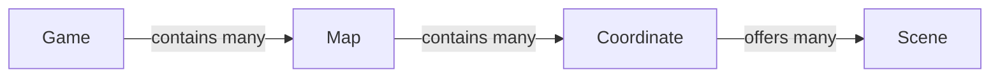

# Game Design Overview

> **Status:** Early design. The game systems described here are not implemented
> yet. The repository currently contains a cross-platform persistence demo for
> the web and desktop applications.

## Vision

Over Yonder is envisioned as a desktop companion and idle game. It should
provide a persistent, atmospheric scene that can stay open alongside the
player's daily activities, with lightweight controls for changing the scene and
opening practical tools.

The current design uses the following references:

| Area                 | Direction              |
| -------------------- | ---------------------- |
| Experience reference | _Ithya: Magic Studies_ |
| Visual direction     | Moebius-inspired art   |

These references communicate the intended experience and visual tone; they do
not imply feature parity.

## Content Model

Game content is organized as a hierarchy. Each parent can contain multiple
children:

| Term       | Meaning                                                                    |
| ---------- | -------------------------------------------------------------------------- |
| Game       | The application and top-level container for all available maps.            |
| Map        | An image-based overview that contains coordinate markers.                  |
| Coordinate | A selectable location rendered on a map.                                   |
| Scene      | An ambient experience available at a coordinate.                           |
| Scene Pack | Configuration and related assets describing maps, coordinates, and scenes. |

The hierarchy describes the product model, not a concrete storage schema.

## Scene Packs

A Scene Pack groups the configuration and assets required to present its maps,
coordinates, and scenes. The design should support:

- Official maps included with or distributed by the game.
- Downloaded third-party maps.
- User-created content.

The package format, validation rules, compatibility policy, and installation
flow have not been defined yet.

## Basic Player Flow

1. The player opens the game and chooses an available map.
2. The selected map is displayed as an image.
3. The game renders coordinate markers over the map.
4. Selecting a coordinate opens a scene-selection drawer.
5. The player chooses one of the scenes available at that coordinate.
6. The selected scene becomes the main desktop companion view.

This flow establishes navigation between content. It does not yet define
progression, unlock requirements, or rewards.

## Scene Interface

The scene view is the primary idle and companion surface. Its initial interface
is expected to provide:

- Scene playback controls.
- Scene variant controls, including weather and time of day.
- An entry point for tools such as a TODO list and timer.
- Background music controls.

The exact behavior, state transitions, and persistence rules for these controls
remain open design questions.

## Undefined Systems

The following systems are outside the current baseline and must not be assumed
to exist:

- Victory, failure, or completion conditions.
- Player progression or long-term growth.
- Economy, currencies, or resource management.
- Combat or other challenge systems.
- A concrete Scene Pack file format or runtime API.
- Save-game structure and cross-platform compatibility rules.

These areas should be documented when their product requirements are defined.
